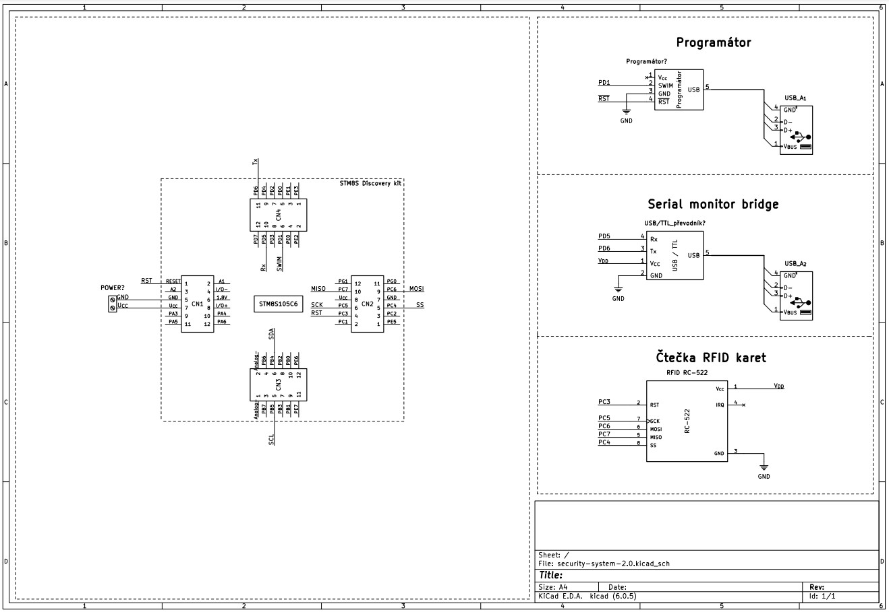

<!-- @format -->

<h1 align="center">
Security system

</h1>

- [Zadání projektu](#Zadani)
- [Periférie](#Periferie)
- [Vedoucí práce](#vedoucí-práce)
- [Materiály](#materiály)
- [Program](https://github.com/peoblouk/security_system/tree/master/program/security_system)
- [Schéma](https://github.com/peoblouk/security_system/tree/master/sch%C3%A9mata/security_system)

# Zadání

- Na univerzální desce plošných spojů sestrojte přístupové zařízení, které by šlo implementovat třeba pro přístup do objektu
- Pro přístup do systému musí uživatel přiložit čip nebo tag na RFID čtečku karet, která mu umožní přístup do systému, pokud se autorizace uživatele povede rozsvítí informační zelená LED a na displeji se vypíše jméno uživatele, které bude předem definované, v opačném případě se rozsvítí červená LED a na displeji se zobrazí přístup odmítnut
- Vytvoření funkční aplikace s programem pro vybraný mikrokontroler
- Vytvoření prezentace (dle pravidel), odevzdání tisknuté dokumentace a zaslání emailu s kompletním výpisem programu nebo zasláním odkazu na repositář na GitHubu

# Periferie

- 1x LCD1602 – zobrazovací periferie (sběrnice I2C)
- 1x PCF8574 – převodník na I2C pro zobrazovací periferii
- 1x RFID-R522 – čtečka přístupových karet (sběrnice SPI)

# Vedoucí práce

- <b>Ing. Marek Nožka</b>

# Materiály

- `https://chytrosti.marrek.cz/mit.html`
- `https://gitlab.com/wykys/stm8s-dero-board`
