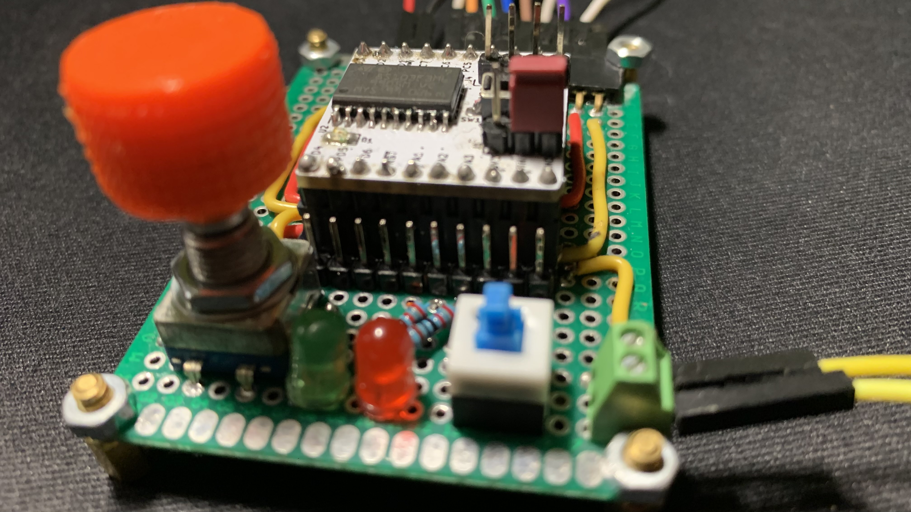
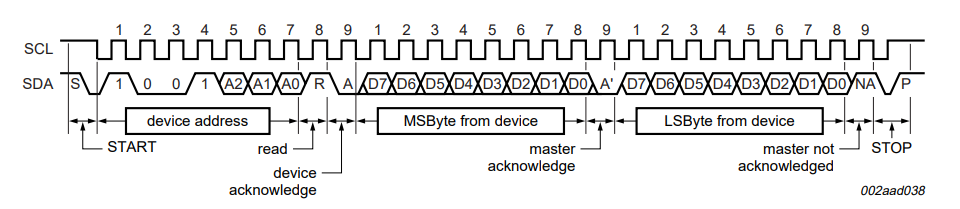
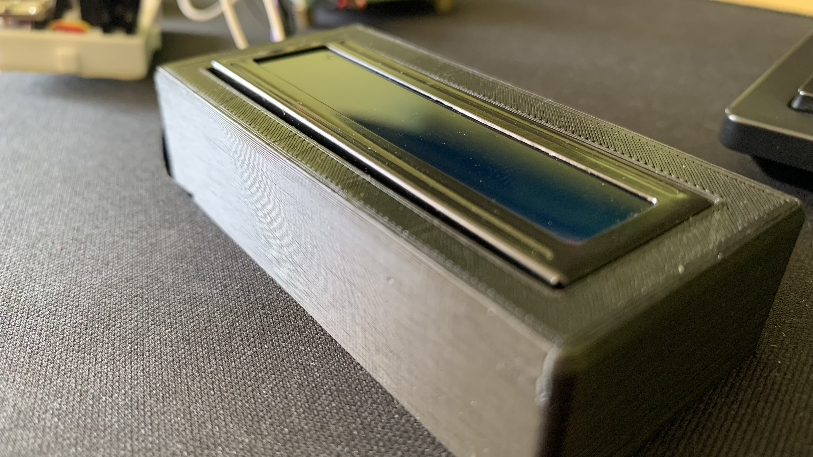

<!-- @format -->

<h1 align="center">
Security system

</h1>

- [Zadání projektu](#Zadani)
- [Periférie](#Periferie)
- [Vedoucí práce](#vedoucí-práce)
- [Materiály](#materiály)
- [Program](https://github.com/peoblouk/security_system/tree/master/program/security_system)
- [Schéma](https://github.com/peoblouk/security_system/tree/master/sch%C3%A9mata/security_system)
- [Obrázky](#obrázky)

# Zadání

- Na univerzální desce plošných spojů sestrojte zařízení, které bude přijimat teploty přes I2C komunikaci
- Vytvoření funkční aplikace s programem pro vybraný mikrokontroler
- Vytvoření shield modulo pro desku DeroBoard
- Vytvoření prezentace (dle pravidel), odevzdání tisknuté dokumentace a zaslání emailu s kompletním výpisem programu nebo zasláním odkazu na repositář na GitHubu

# LM75A I2C read frame

  

# Periferie

- 1x LCD1602 – zobrazovací periferie (sběrnice I2C)
- 1x PCF8574 – převodník na I2C pro zobrazovací periferii
- 3x CJMCU-75A - teploměr přes I2C
  

# Obrázky

  
  
  

# Vedoucí práce

- <b>Ing. Marek Nožka</b>

# Materiály

- `https://chytrosti.marrek.cz/mit.html`
- `https://gitlab.com/wykys/stm8s-dero-board`
